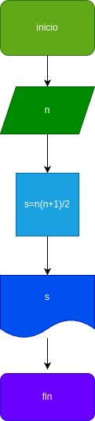

# programa #1
programa prara sumar los numeros naturales

# Analisis 

## imput
### Variables de entrada 
n/ valor a ingresar 
### processing 
s/ suma de los _n_primeros numeros

### output
s=(n*(n+1))/2
# Diseño

# Construccion

